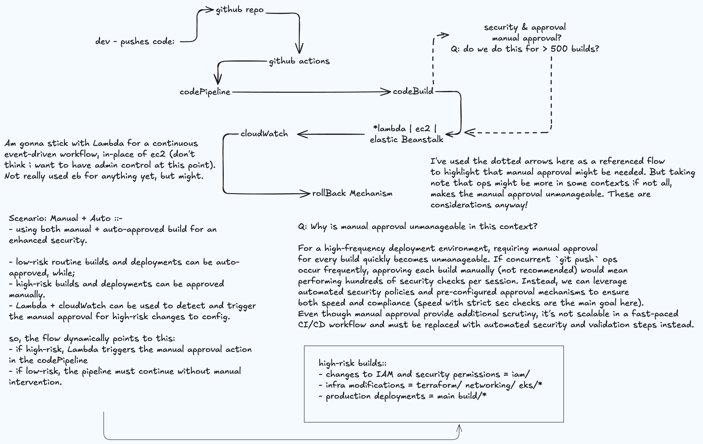

# CodePipeline CICD Workflow

### **Key Components and Responsibilities**  
1. **Source Control (GitHub)**  
   - Stores application source code.  
   - Triggers pipeline execution on new commits to the repository.  
2. **GitHub Actions (CI - Continuous Integration)**  
   - Runs unit tests and builds artifacts before AWS deployment.  
   - Prevents broken builds from entering AWS CodePipeline.  
3. **AWS CodePipeline (Orchestration Service for CI/CD)**  
   - Manages the deployment workflow.  
   - Triggers AWS CodeBuild for application testing and packaging.  
   - Deploys the application based on the configured target (Lambda, Elastic Beanstalk, or EC2).  
4. **AWS CodeBuild (Build and Test Service)**  
   - Installs dependencies, runs tests, and packages the application.  
   - Generates deployable artifacts.  
5. **Deployment Targets (Choose one or multiple based on application needs)**  
   - **AWS Lambda:** If the application is serverless. -< Using Lambda
   - **Elastic Beanstalk:** If using managed infrastructure for web apps.  
   - **Amazon EC2:** If requiring full control over servers.  
6. **AWS CloudWatch (Monitoring & Logging)**  
   - Logs build and deployment activities.  
   - Provides real-time pipeline insights.  
7. **Rollback Mechanism (For Failures)**  
   - Ensures automatic rollback if deployment fails. 

