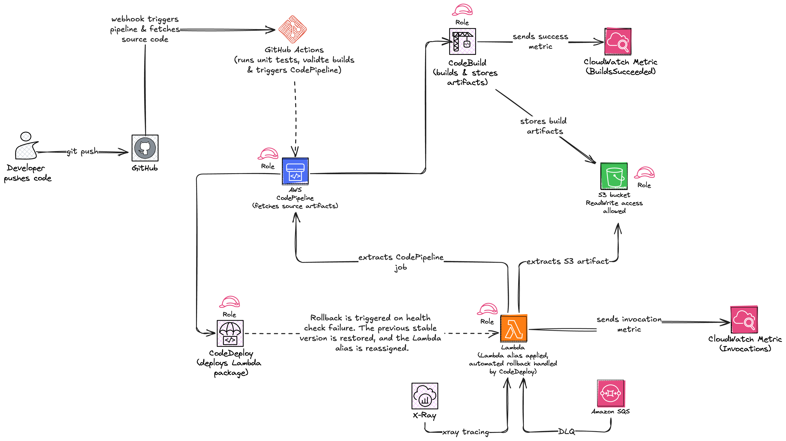

# Project Name: AWS CDK - CI/CD Pipeline Automation





This project provides an automated infrastructure deployment solution for AWS Lambda functions using the AWS Cloud Development Kit (CDK) with Go. It streamlines the process of building, packaging, and deploying Lambda functions through AWS CodeBuild integration.

The project implements a robust CI/CD pipeline that handles the complete lifecycle of Lambda function deployment. It uses Go for both the infrastructure definition and Lambda function implementation, ensuring type safety and performance. The build process is automated through AWS CodeBuild, with comprehensive build specifications that handle dependency management, compilation, and packaging of Lambda functions for deployment.

## Repository Structure
```
.
├── bin/                          # Main application directory
│   ├── cdk_test.go              # CDK infrastructure tests
│   ├── cdk.go                   # Main CDK application entry point
│   ├── cdk.json                 # CDK configuration and context settings
│   ├── lambda/                  # Lambda function source code
│   │   └── pipeline.go          # Main Lambda function implementation
│   └── script/                  # Build and deployment scripts
│       └── script.sh            # Lambda function packaging script
├── buildspec.yml                # AWS CodeBuild configuration
├── config/                      # Application configuration
│   └── env.go                   # Environment configuration
├── docs/                        # Project documentation
│   ├── arch.md                  # Architecture documentation
│   └── GUIDE.MD                 # User guide
└── errors/                      # Error documentation
    └── err1.md                  # Error handling documentation
```

## Usage Instructions

### Prerequisites
- Go 1.x or later
- AWS CLI configured with appropriate credentials
- AWS CDK CLI installed
- ZIP utility for packaging Lambda functions

### Installation
```bash
# Clone the repository
git clone <repository-url>
cd <repository-name>

# Install dependencies
cd bin
go mod tidy

# Install AWS CDK CLI if not already installed
npm install -g aws-cdk
```

### Quick Start
1. Configure your AWS credentials:
```bash
aws configure
```

2. Deploy the infrastructure:
```bash
cd bin
cdk deploy
```

3. Build and package the Lambda function:
```bash
cd script
./script.sh
```

### More Detailed Examples
Building the Lambda function manually:
```bash
cd bin/lambda
CGO_ENABLED=0 GOOS=linux GOARCH=amd64 go build -o bootstrap pipeline.go
chmod +x bootstrap
zip -X lambda_function.zip bootstrap
```

Using AWS CodeBuild for automated builds:
```bash
# Trigger CodeBuild project
aws codebuild start-build --project-name <project-name>
```

### Troubleshooting

Common Issues:

1. Lambda Function Build Failures
   - Error: "go: command not found"
   - Solution: Ensure Go is installed and GOPATH is properly set
   - Debug: `go version && echo $GOPATH`

2. CDK Deployment Issues
   - Error: "Unable to resolve AWS account to use"
   - Solution: Verify AWS credentials are properly configured
   - Debug: `aws sts get-caller-identity`

3. Package Creation Issues
   - Error: "bootstrap: permission denied"
   - Solution: Ensure execute permissions are set
   - Debug: `ls -l bootstrap && chmod +x bootstrap`

## Data Flow
The system processes Lambda function deployments through a series of build and packaging steps, culminating in deployment through CDK. The process handles both the infrastructure provisioning and application deployment in a coordinated manner.

```ascii
[Source Code] -> [Build Process] -> [Package Creation] -> [CDK Deployment]
     |               |                    |                     |
     v               v                    v                     v
  pipeline.go -> bootstrap binary -> lambda_function.zip -> AWS Lambda
```

Key Component Interactions:
1. Source code is compiled targeting Linux/amd64 platform
2. Build process creates executable binary named 'bootstrap'
3. Packaging script creates deployment ZIP file
4. CDK handles infrastructure provisioning
5. CodeBuild automates the build and packaging process
6. AWS Lambda receives and deploys the packaged function

## Infrastructure
The infrastructure is defined using AWS CDK with the following key configurations:

Lambda:
- Runtime: Go 1.x
- Architecture: amd64
- Platform: Linux

CodeBuild:
- Build specification: buildspec.yml
- Runtime: Go 1.x
- Artifacts: All files preserved with directory structure

## Deployment
Prerequisites:
- AWS account with appropriate permissions
- Configured AWS credentials

Deployment Steps:
1. Initialize CDK project:
```bash
cdk init
```

2. Deploy infrastructure:
```bash
cdk deploy
```

3. Monitor deployment:
```bash
cdk diff
```